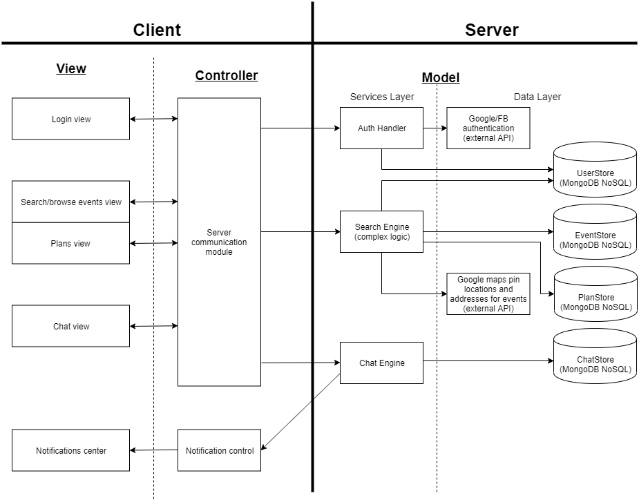

# evnt

This is the repository corresponding with the Android front-end for evnt.

You can find the NodeJS backend [here](https://github.com/swe-rp/server).

## Application details

evnt is an event management application. It allows users to browse a list of pre-planned events, add new events as hosts or add existing events to a list that they will choose to attend. It's most appealing feature is the ability to recommend the best event for the current user based on their history of types of events attended, current time and geographical location - an ideal and spontaneous solution for when you finally have some free time!

As part of course work for CPEN 321 (Software Engineering) at UBC, the application had 3 major requirements to fulfill:

-   to be useful to someone
-   to integrate external API
-   to have real-time notifications or live chat

## Application Design

### Use cases

1.  Get the app to pick an event for you
2.  Browsing events
3.  Adding and removing events from personal list
4.  Create and delete events as a host
5.  Live chat with users planning to attend the same event
6.  Location screenshots from Google Maps API
7.  User authentication using Facebook OAuth

### Main components and application architecture

We used an MVC model to plan and implement the required functionality for our application.

Some more helpful diagrams can be found in the `img` folder of the repository.

## Technologies used (front-end only)

-   Android Studio for native Android builds
-   Volley for server communication
-   Facebook OAuth services
-   Firebase Messaging for real-time notifications
-   Websockets for live chat functionality
-   Google Maps API for event location screenshots
-   Espresso testing framework for automated UI tests

## What it looks like

You can see the application in action at the video link below!

